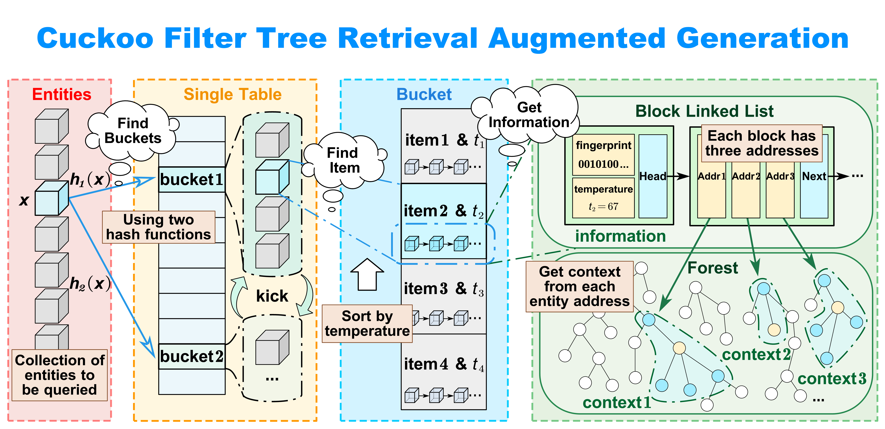
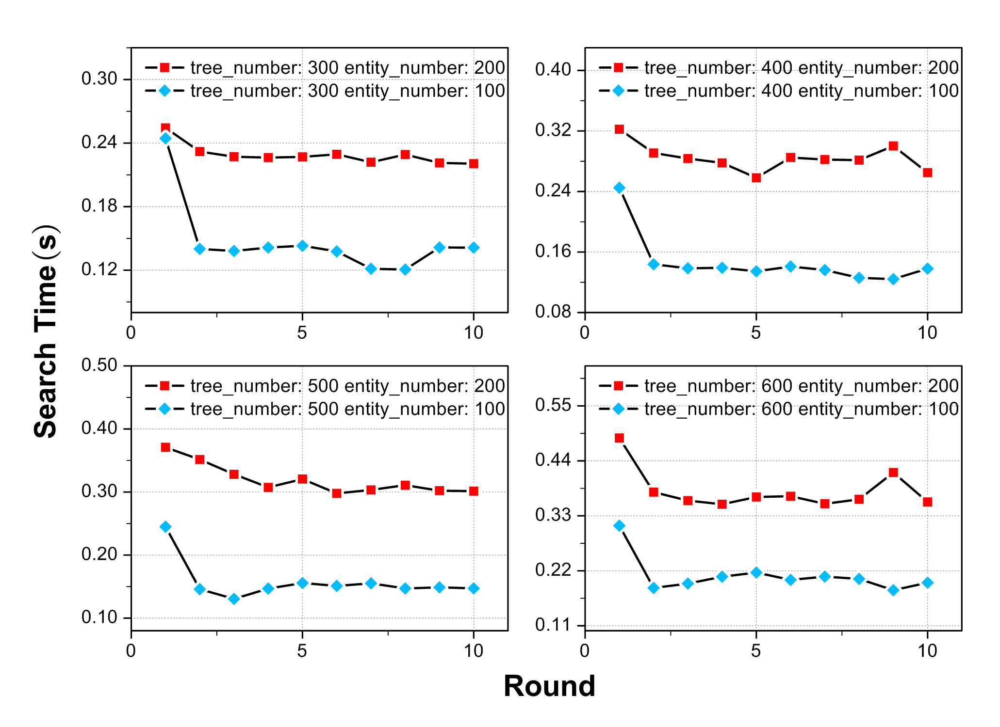

# CFT-RAG-2025
CFT-RAG: An Entity Tree Based Retrieval Augmented Generation Algorithm With Cuckoo Filter



<!-- ## 1. Result

* Average Retrieval Time: Average total time to extract entities, which is calculated by selecting or generating 36 questions on each dataset.
* Time Ratio: Ratio of entity retrieval time to large language model response time(response time = retrieval time + inference time).
* Accuracy: The accuracy obtained by using langsmith to rate the content of the large language model responses. T-RAGs using different methods retrieve the same content, with only minor differences in the accuracy of model responses.


### MedQA

|            | Text-Based RAG | Naive T-RAG | BF T-RAG | BF2 T-RAG | ANN T-RAG | ANN G-RAG | CF T-RAG |
| ---------- | ---------- | ----------- | -------- | --------- | --------- | --------- | -------- |
| Average Retrieval Time | -          | 18.37s         | 10.09s      | 9.70s       | 7.52s       | 8.11s       | **5.04s**      |
| Time Ratio | -          | 56%         | 31%      | 29%       | 23%       | 24%       | **15%**      |
| Accuracy   | 53%        | 68%         | 68%      | 68%       | 68%       | 62%       | **68%**     |

### AESLC

|            | Text-Based RAG | Naive T-RAG | BF T-RAG | BF2 T-RAG | ANN T-RAG | ANN G-RAG | CF T-RAG |
| ---------- | ---------- | ----------- | -------- | --------- | --------- | --------- | -------- |
| Average Retrieval Time | -          | 12.11s         | 5.04s      | 5.87s       | 2.22s       | 2.14s       | **0.95s**      |
| Time Ratio | -          | 61%         | 25%      | 28%       | 11%       | 10%       | **5%**      |
| Accuracy   | 40%        | 56%         | 56%      | 56%       | 56%       | 54%       | **56%**     |

### DART

|            | Text-Based RAG | Naive T-RAG | BF T-RAG | BF2 T-RAG | ANN T-RAG | ANN G-RAG | CF T-RAG |
| ---------- | ---------- | ----------- | -------- | --------- | --------- | --------- | -------- |
| Average Retrieval Time | -          | 15.88s         | 9.65s      | 8.13s       | 3.25s       | 3.91s       | **1.78s**      |
| Time Ratio | -          | 72%         | 44%      | 37%       | 15%       | 18%       | **8%**      |
| Accuracy   | 55%        | 67%         | 67%      | 67%       | 67%       | 65%       | **67%**     |

## 2. Use Case

Rare Entity: Entity with no more than 0.1% presence.

### A. 1-Hop + Easy Question

> Question: What causes Horner's syndrome?
> 
> Key Answer: Paralysis of ocular sympathetic nerves.
>
> Rare Entity: ocular_sympathetic_nerves.

#### Text-Based RAG

| Retrieval Time | Response Time | Time Ratio | Accuracy |
| -------------- | ------------- | ---------- | -------- |
| -              | 25.87s        | -          | 56%      |

> * Question: What causes Horner's syndrome?
> 
> * Answer: Horner's syndrome is caused by a disruption of the sympathetic nerve pathway that supplies the eye and face. This disruption can occur at any point along the three-neuron sympathetic chain, which extends from the hypothalamus to the eye...

#### ANN Graph-RAG

| Retrieval Time | Response Time | Time Ratio | Accuracy |
| -------------- | ------------- | ---------- | -------- |
| 7.53s          | 24.30s        | 30.99%     | 60%      |

> * Question: What causes Horner's syndrome?
> 
> * Answer: Symptoms of Horner's syndrome include ptosis (drooping eyelid), miosis (constricted pupil), anhidrosis (lack of sweating), and enophthalmos (sunken eye appearance). Identifying the underlying cause is crucial, as some causes, such as carotid artery dissection, require urgent medical attention...

#### Cuckoo Filter Tree-RAG

| Retrieval Time | Response Time | Time Ratio | Accuracy |
| -------------- | ------------- | ---------- | -------- |
| 4.72s          | 21.54s        | 21.92%     | 66%      |

> * Relation: Horner - ocular sympathetic nerves
> 
> * Question: What causes Horner's syndrome?
> 
> * Answer: Horner's syndrome is caused by paralysis of the ocular sympathetic nerves. Because Horner’s syndrome can be a sign of serious conditions like carotid artery dissection or lung tumors, it often requires urgent medical evaluation...

### B. 2-Hop + Easy Question

> Question: What is the most essential component for culturing Mycoplasma?
> 
> Key Answer: Cholesterol supplements.
>
> Rare Entity: cholesterol_supplements.

#### Text-Based RAG

| Retrieval Time | Response Time | Time Ratio | Accuracy |
| -------------- | ------------- | ---------- | -------- |
| -              | 25.12s        | -          | 45%      |

> * Question: What is the most essential component for culturing Mycoplasma?
> 
> * Answer: The most essential component for culturing Mycoplasma is a specialized growth medium containing sterols. Since Mycoplasma lack a cell wall, they require sterols to maintain membrane integrity...

#### ANN Graph-RAG

| Retrieval Time | Response Time | Time Ratio | Accuracy |
| -------------- | ------------- | ---------- | -------- |
| 7.98s          | 23.46s        | 34.01%     | 61%      |

> * Question: What is the most essential component for culturing Mycoplasma?
> 
> * Answer: The most essential component for culturing Mycoplasma is a rich growth medium supplemented with sterols. Since Mycoplasma species lack a cell wall and cannot synthesize sterols on their own, they require cholesterol for membrane stability...

#### Cuckoo Filter Tree-RAG

| Retrieval Time | Response Time | Time Ratio | Accuracy |
| -------------- | ------------- | ---------- | -------- |
| 3.86s          | 19.62s        | 19.67%     | 67%      |

> * Relation: - Mycoplasma - cholesterol*, cholesterol* - horse serum, cholesterol* - cholesterol supplements
> 
> * Question: What is the most essential component for culturing Mycoplasma?
> 
> * Answer: The most essential component for culturing Mycoplasma is cholesterol. Mycoplasma are prokaryotic organisms that lack a cell wall, and their cell membrane requires cholesterol for stability and function. Therefore, the culture medium must include cholesterol, such as horse serum or cholesterol supplements, to support their growth. Additionally...

### C. Multi-Hop + Hard Question

**When the problem is complex and the required entity relationships are precise, Tree-RAG shows a obvious advantage over the other two methods.**

> Question: here are five types of hydrogen carriers involved in electron transfer, which proceed in a specific order. Can you describe the detailed process?
> 
> Answer: flavoprotein, coenzyme I, iron-sulfur protein, ubiquinone, cytochrome. 
>
> Rare Entity: flavoprotein, coenzyme, iron-sulfur_protein, ubiquinone, cytochrome. 

#### Text-Based RAG

| Retrieval Time | Response Time | Time Ratio | Accuracy |
| -------------- | ------------- | ---------- | -------- |
| -              | 38.62s        | -          | 40%      |

> * Question: There are five types of hydrogen carriers involved in electron transfer, which proceed in a specific order. Can you describe the detailed process?
> 
> * Answer: NADH donates electrons to Complex I, FADH₂ donates to Complex II. Electrons transfer to ubiquinone (CoQ) converted to ubiquinol (QH₂). Ubiquinol transfers electrons to cytochrome b-c₁ complex (Complex III). Electrons pass through cytochrome c and reach Complex IV...

#### ANN Graph-RAG

| Retrieval Time | Response Time | Time Ratio | Accuracy |
| -------------- | ------------- | ---------- | -------- |
| 9.02s          | 30.15s        | 29.91%     | 49%      |

> * Question: There are five types of hydrogen carriers involved in electron transfer, which proceed in a specific order. Can you describe the detailed process?
> 
> * Answer: NADH donates electrons to Complex I (via FMN) or FADH₂ donates to Complex II, Fe-S clusters pass electrons one at a time to downstream carriers. Ubiquinone (CoQ) accepts electrons and protons, becoming ubiquinol (QH₂), which shuttles electrons to Complex III. Cytochromes in Complex III pass electrons to cytochrome c, which carries them to Complex IV. Complex IV (cytochrome c oxidase) transfers electrons to O₂, reducing it to H₂O...

#### Cuckoo Filter Tree-RAG

| Retrieval Time | Response Time | Time Ratio | Accuracy |
| -------------- | ------------- | ---------- | -------- |
| 4.75s          | 27.02s        | 17.58%     | 69%      |

> * Relation: electron transfer - hydrogen carriers, hydrogen carriers - process*, process* - 1.flavoprotein, process* - 2.coenzyme I, process* - 3.iron-sulfur protein, process* - 4.ubiquinone, process* - 5.cytochrome
> 
> * Question: There are five types of hydrogen carriers involved in electron transfer, which proceed in a specific order. Can you describe the detailed process?
> 
> * Answer: The process can be summarized as follows: flavoprotein → coenzyme I → iron-sulfur protein → ubiquinone → cytochrome. Flavoproteins, such as NADH dehydrogenase (Complex I) and succinate dehydrogenase (Complex II), contain flavin mononucleotide (FMN) or flavin adenine dinucleotide (FAD) as prosthetic groups. These enzymes play a crucial role in electron transfer from NADH or succinate to downstream components of the ETC... -->

## 1. Code Usage

### Configuration

```bash
pip install uv
uv sync
pip install lab-1806-vec-db==0.2.3 python-dotenv sentence-transformers openai pybloom_live
export HF_ENDPOINT=https://hf-mirror.com
python -m spacy download zh_core_web_sm
```

### Complete Process of CFT-RAG

Arguments:

* `vec-db-key`: The key for the vector database.
* `tree-num-max`: The maximum number of trees to build.
* `entities-file-name`: The name of the entities file.
* `search-method`: The search method to use: 
  - `0` for Vector Database Only
  - `1` for Naive Tree-RAG 
  - `2` for Bloom Filter Search in Tree-RAG
  - `5` for improved Bloom Filter Search in Tree-RAG
  - `7` for Cuckoo Filter in Tree-RAG
  - `8` for Approximate Nearest Neighbors in Tree-RAG
  - `9` for Approximate Nearest Neighbors in Graph-RAG
* `node-num-max`: The maximum number of nodes to build.

Example: 

```
python main.py --tree-num-max 50 --search-method 7
```

### Test Cuckoo Filter



Individually testing the performance of the improved Cuckoofilter and the sorting results:

```
python test_tree.py
```

## 2. Reference

`TRAG-cuckoofilter` is based on https://github.com/efficient/cuckoofilter.

Use of datasets: 

| Dataset | MedQA                           | AESLC                                           | DART                              | Rui'an People's Hospital |
| ------- | ------------------------------- | ----------------------------------------------- | --------------------------------- | ------------------------ |
| Scale   | Large                           | Medium                                          | Medium                            | Small                    |
| Source  | https://github.com/jind11/MedQA | https://huggingface.co/datasets/Yale-LILY/aeslc | https://github.com/Yale-LILY/dart | https://www.rahos.gov.cn |