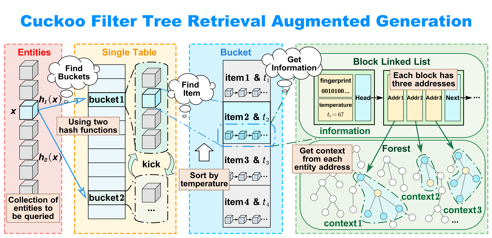
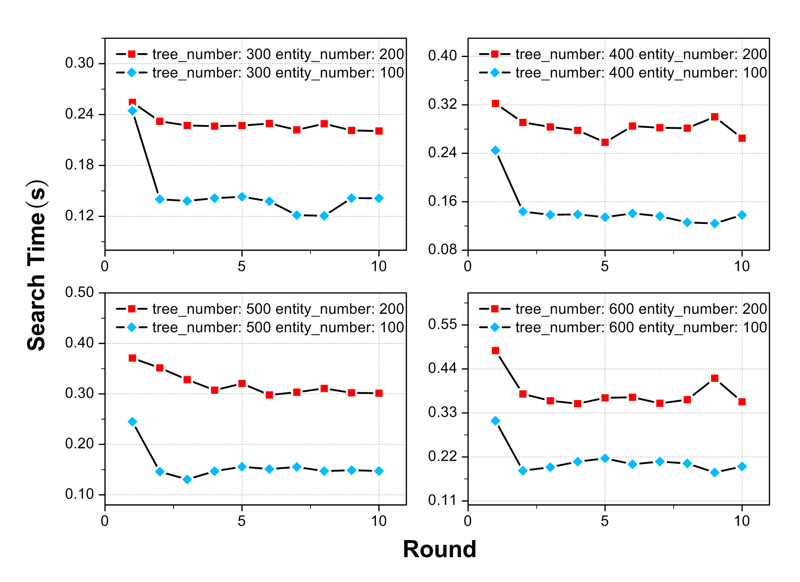

# CFT-RAG-2025
CFT-RAG: An Entity Tree Based Retrieval Augmented Generation Algorithm With Cuckoo Filter



## 1. Result

|            | Only VecDB | Naive T-RAG | BF T-RAG | BF2 T-RAG | ANN T-RAG | ANN G-RAG | CF T-RAG |
| ---------- | ---------- | ----------- | -------- | --------- | --------- | --------- | -------- |
| Time Ratio | -          | 56%         | 31%      | 29%       | 23%       | 24%       | **15%**      |
| Accuracy   | 53%        | 68%         | 68%      | 68%       | 68%       | 62%       | **68%**     |

* Time Ratio: Ratio of entity retrieval time to large language model inference time that averages multiple datasets, multiple numbers of entities including long questions containing a large number of entities.
* Accuracy: The accuracy obtained by using langsmith to rate the content of the large language model responses. T-RAGs using different methods retrieve the same content, with only minor differences in the accuracy of model responses.

## 2. Use Case

### A. 1-Hop + Easy Question

> Question: What causes Horner's syndrome?
> 
> Key Answer: Paralysis of ocular sympathetic nerves.

#### Only VecDB

> * Question: What causes Horner's syndrome?
> 
> * Answer: Horner's syndrome is caused by a disruption of the sympathetic nerve pathway that supplies the eye and face. This disruption can occur at any point along the three-neuron sympathetic chain, which extends from the hypothalamus to the eye...

#### Graph-RAG

> * Question: What causes Horner's syndrome?
> 
> * Answer: Symptoms of Horner's syndrome include ptosis (drooping eyelid), miosis (constricted pupil), anhidrosis (lack of sweating), and enophthalmos (sunken eye appearance). Identifying the underlying cause is crucial, as some causes, such as carotid artery dissection, require urgent medical attention...

#### Tree-RAG

> * Relation: Horner - ocular sympathetic nerves
> 
> * Question: What causes Horner's syndrome?
> 
> * Answer: Horner's syndrome is caused by paralysis of the ocular sympathetic nerves. Because Horner’s syndrome can be a sign of serious conditions like carotid artery dissection or lung tumors, it often requires urgent medical evaluation...

### B. 2-Hop + Easy Question

> Question: What is the most essential component for culturing Mycoplasma?
> 
> Key Answer: Cholesterol supplements.

#### Only VecDB

> * Question: What is the most essential component for culturing Mycoplasma?
> 
> * Answer: The most essential component for culturing Mycoplasma is a specialized growth medium containing sterols. Since Mycoplasma lack a cell wall, they require sterols to maintain membrane integrity...

#### Graph-RAG

> * Question: What is the most essential component for culturing Mycoplasma?
> 
> * Answer: The most essential component for culturing Mycoplasma is a rich growth medium supplemented with sterols. Since Mycoplasma species lack a cell wall and cannot synthesize sterols on their own, they require cholesterol for membrane stability...

#### Tree-RAG

> * Relation: - Mycoplasma - cholesterol*, cholesterol* - horse serum, cholesterol* - cholesterol supplements
> 
> * Question: What is the most essential component for culturing Mycoplasma?
> 
> * Answer: The most essential component for culturing Mycoplasma is cholesterol. Mycoplasma are prokaryotic organisms that lack a cell wall, and their cell membrane requires cholesterol for stability and function. Therefore, the culture medium must include cholesterol, such as horse serum or cholesterol supplements, to support their growth. Additionally...

### C. Multi-Hop + Hard Question

> Question: here are five types of hydrogen carriers involved in electron transfer, which proceed in a specific order. Can you describe the detailed process?
> 
> Answer: flavoprotein, coenzyme I, iron-sulfur protein, ubiquinone, cytochrome. 

#### Only VecDB

> * Question: There are five types of hydrogen carriers involved in electron transfer, which proceed in a specific order. Can you describe the detailed process?
> 
> * Answer: NADH donates electrons to Complex I, FADH₂ donates to Complex II. Electrons transfer to ubiquinone (CoQ) converted to ubiquinol (QH₂). Ubiquinol transfers electrons to cytochrome b-c₁ complex (Complex III). Electrons pass through cytochrome c and reach Complex IV...

#### Graph-RAG


> * Question: There are five types of hydrogen carriers involved in electron transfer, which proceed in a specific order. Can you describe the detailed process?
> 
> * Answer: NADH donates electrons to Complex I (via FMN) or FADH₂ donates to Complex II, Fe-S clusters pass electrons one at a time to downstream carriers. Ubiquinone (CoQ) accepts electrons and protons, becoming ubiquinol (QH₂), which shuttles electrons to Complex III. Cytochromes in Complex III pass electrons to cytochrome c, which carries them to Complex IV. Complex IV (cytochrome c oxidase) transfers electrons to O₂, reducing it to H₂O...

#### Tree-RAG


> * Relation: electron transfer - hydrogen carriers, hydrogen carriers - process*, process* - flavoprotein, process* - coenzyme I, process* - iron-sulfur protein, process* - ubiquinone, process* - cytochrome
> 
> * Question: There are five types of hydrogen carriers involved in electron transfer, which proceed in a specific order. Can you describe the detailed process?
> 
> * Answer: The process can be summarized as follows: flavoprotein → coenzyme I → iron-sulfur protein → ubiquinone → cytochrome. Flavoproteins, such as NADH dehydrogenase (Complex I) and succinate dehydrogenase (Complex II), contain flavin mononucleotide (FMN) or flavin adenine dinucleotide (FAD) as prosthetic groups. These enzymes play a crucial role in electron transfer from NADH or succinate to downstream components of the ETC...

## 3. Code Usage

### Complete Process of CFT-RAG

Arguments:

* `vec-db-key`: The key for the vector database.
* `tree-num-max`: The maximum number of trees to build.
* `entities-file-name`: The name of the entities file.
* `search-method`: The search method to use: 
  - 0 for Vector Database Only
  - 1 for Naive Tree-RAG
  - 2 for Bloom Filter Search
  - 5 for improved Bloom Filter Search
  - 7 for Cuckoo Filter
  - 8 for Approximate Nearest Neighbors in Tree-RAG
  - 9 for Approximate Nearest Neighbors in Graph-RAG
* `node-num-max`: The maximum number of nodes to build.

Example: 

```
python main.py --tree-num-max 50 --search-method 7
```

### Test Cuckoo Filter



Individually testing the performance of the improved Cuckoofilter and the sorting results:

```
python test_tree.py
```

## 4. Reference

`TRAG-cuckoofilter` is based on https://github.com/efficient/cuckoofilter.

Use of data sets: 

* Medical Exams: https://github.com/jind11/MedQA
* AESLC: https://huggingface.co/datasets/Yale-LILY/aeslc
* DART: https://github.com/Yale-LILY/dart
